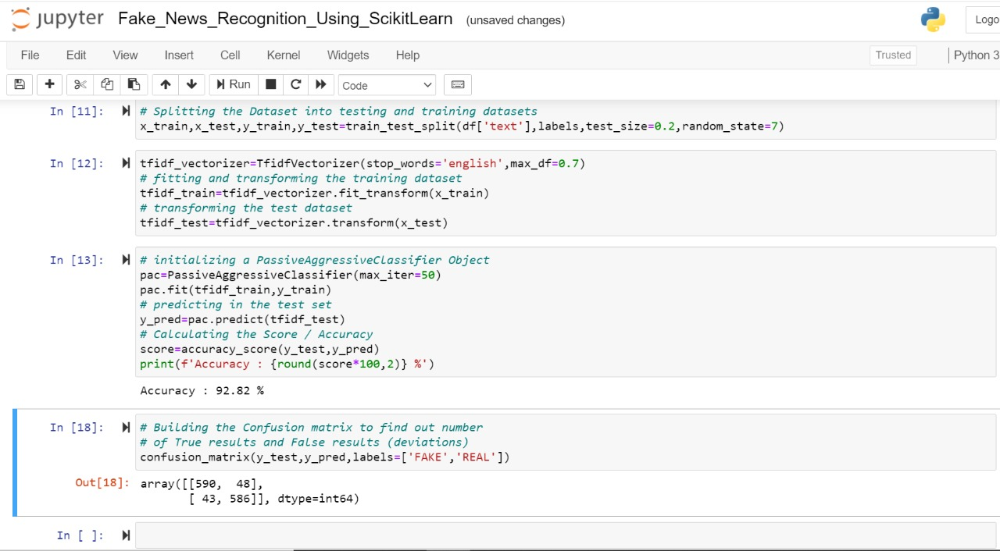

# Simple-Fake-News-Recognition-Using-SkLearn
### A Simple Fake News Recognition Using SkLearn
The advent of the World Wide Web and the rapid adoption of social media platforms (such as Facebook and Twitter) paved the way for information dissemination that has never been witnessed in the human history before. Besides other use cases, news outlets benefitted from the widespread use of social media platforms by providing updated news in near real time to its subscribers. The news media evolved from newspapers, tabloids, and magazines to a digital form such as online news platforms, blogs, social media feeds, and other digital media formats. It became easier for consumers to acquire the latest news at their fingertips. Facebook referrals account for 70% of traffic to news websites. These social media platforms in their current state are extremely powerful and useful for their ability to allow users to discuss and share ideas and debate over issues such as democracy, education, and health. However, such platforms are also used with a negative perspective by certain entities commonly for monetary gain and in other cases for creating biased opinions, manipulating mindsets, and spreading satire or absurdity. The phenomenon is commonly known as fake news.
Read more at : https://www.hindawi.com/journals/complexity/2020/8885861/

 

### Trying to Improve Accuracy ... Current Best = 92.8 %

 

